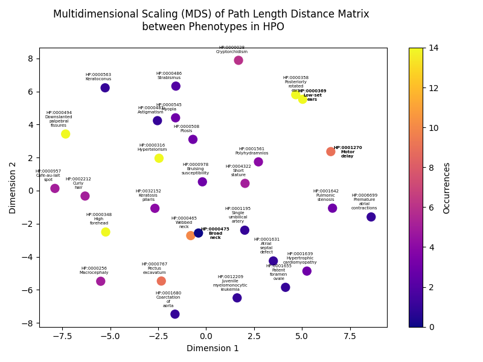

# Scenario 5: Genetic Analysis Case Study on NRAS gene

## An Undiagnosed Child with Delayed Motor Development and Generalized Dysmorphism

On clinical examination, the undiagnosed child was found to have several facial dysmorphisms, in particular a broad neck and low-set ears. It has also been assessed that the child exhibits delayed motor development.

Genetic testing has been performed using Whole Exome Sequencing (WES) which identified a probable pathogenic mutation in the NRAS gene.

---

## Research Questions

### Question 1: Gene Mutation Prevalence

Are there any other individuals with a mutation in the same gene?

To answer this question the SPARQL query below has been used for finding the phenopackets that include at least one mutation in the NRAS gene. To identify the correct gene descriptions, the HGNC gene ID is used of NRAS being [HGNC:7989](https://www.genenames.org/data/gene-symbol-report/#!/hgnc_id/7989).

```{glue} scenario5_query_q1
:doc: nras_notebook.ipynb
:language: sparql
```

As shown below, a total of fourteen phenopackets have been found including phenotypic and genetic information related to mutations in the NRAS gene. This set of phenopackets has been created by the same researcher at the same datetime based on the metadata. 

```{glue} scenario5_phenopackets
:doc: nras_notebook.ipynb
```

### Question 2: Phenotype and Disease Prevalence

What phenotypes and which diseases have been observed in these individuals and how often do they occur in this group of individuals?

The phenopackets found for the previous question can now be analysed to conclude which phenotypes and diseases occur in this group of individuals. This is done by using SPARQL queries for acquiring the associated phenotypes and diseases. The query below searches for all diagnosed diseases in the relevant phenopackets.

```{glue} scenario5_query_q2a
:doc: nras_notebook.ipynb
:language: sparql
```

Given the results of the SPARQL query shown above, the individuals for which mutations are found in the NRAS gene are all diagnosed with Noonan syndrome 6. 


```{glue} scenario5_diseases
:doc: nras_notebook.ipynb
```

The query shown below searches for all phenotypes that are associated with at least one of the relevant phenopackets.

```{glue} scenario5_query_q2b
:doc: nras_notebook.ipynb
:language: sparql
```

A total of 157 {glue:}`scenario5_phenofeat_count:nras_notebook.ipynb` phenotypes have been found. A sample of these results are shown below:

```{glue} scenario5_phenofeat
:doc: nras_notebook.ipynb
```

Given these results, the occurrence of each phenotype is calculated:

```{glue} scenario5_phenofeatcounts
:doc: nras_notebook.ipynb
```

### Question 3: Matching Phenotypes

Do the found phenotypes overlap with the phenotypes observed in the undiagnosed child?

Multiple phenotypes have been observed in the undiagnosed child being broad neck, low-set ears and motor delay. In order to match the observed phenotypes with the phenotypes observed in the phenopackets, the [Human Phenotype Ontology (HPO)](https://hpo.jax.org/) identifiers need to be retrieved. These identifiers are acquired by querying over this HPO ontology matching the phenotypes with the labels of the terms that are part of HPO. Below, a SPARQL query is shown that searches for the identifier for the broad neck phenotype:

```{glue} scenario5_query_q4_0
:doc: nras_notebook.ipynb
:language: sparql
```

Executing this SPARQL query for all observed phenotypes results in the following identifiers:

```{glue} scenario5_observedphenotypes
:doc: nras_notebook.ipynb
```

Next, the list of observed phenotypes can be compared with the list of phenotypes associated with the selection of phenopackets coming to the conclusion that the observed phenotypes Motor delay (HP:0001270), Low-set ears (HP:0000369) {glue:}`scenario5_matchingphenotypes:nras_notebook.ipynb` are also found in the individuals represented in the phenopackets. 

It is still possible to gather more information about the observed phenotype that has not been found in at least one of the phenopackets. One step would be to investigate the closeness of the observed phenotype to the phenotypes associated with Noonan syndrome 6 given their relative positions in the HPO ontology. To be more explicit, this closeness can be calculated by acquiring the shortest path length between phenotypes in a network. This network is built by adding each phenotype as a node. An edge between two nodes represents the relation of one phenotype being the subclass or superclass of another phenotype.

Given the path length distances between each pair of phenotypes, the phenotypes can be shown on a two-dimensional plot by applying multidimensional scaling. In this way, a clear overview is generated of all phenotypes and their similarities expressed in their positions in the two dimensional space. This plot is shown below:



The phenotypes labeled in bold text are the phenotypes observed in the undiagnosed child. Again, it can be seen that the phenotypes low-set ears and motor delay are also found in patients with Noonan syndrome 6 given the colors of the points that represent the phenotypes. Interestingly, this plot also shows that the remaining observed phenotype "broad neck" seems to be similar to phenotype "webbed neck" that is also associated in group of individuals with this same diagnosis. 

---

## Conclusion

Given the mutations in the NRAS gene identified in individuals with Noonan syndrome 6 and the overlap and similarities between the observed phenotypes and the phenotypes associated with the individuals diagnosed with Noonan syndrome 6, there is reason to further investigate Noonan syndrome 6 as being a likely diagnosis for the child.

---